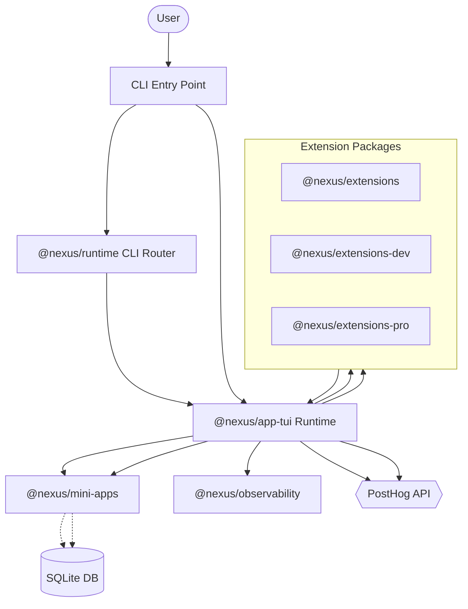

# Architecture

Nexus is a monorepo built on Turborepo that wraps and extends the Pi TUI with bundled extensions and mini-app management. The system follows a layered architecture: the TUI app delegates CLI routing to `@nexus/runtime`, extension loading to feature-flagged packages, and daemon management to `@nexus/mini-apps`. All telemetry flows through `@nexus/observability` with OpenTelemetry.

The app supports two runtime modes. In source mode (`just dev`), extensions import from `@nexus/extensions` pointing to source TypeScript. In release mode, extensions compile into a single binary via `scripts/release/buildBinaryBundle.mjs`, selecting only feature-flagged extensions at compile time through `generate:feature-flags`.

## Components

- **TUI App** (`apps/tui`) — Terminal UI, CLI argument parsing, session management, startup screen
- **Extension Registry** (`packages/extension-core`, `packages/extensions-pro`, `packages/extensions-dev`) — Modular features loaded by runtime based on feature-flags.json
- **Mini-Apps** (`packages/mini-apps`) — Managed daemon lifecycle with SQLite storage, heartbeat monitoring, CLI integration
- **Runtime Core** (`packages/nexus-runtime`) — Self-launch helpers, config resolution, CLI feature availability
- **Telemetry** (`packages/observability`) — OpenTelemetry event tracking, sanitized attributes, PostHog backend

## System Diagram

## Data Flow

1. **CLI invocation** — `apps/tui/src/index.ts` or `index.release.ts` routes to CLI router or bundled app runner
2. **Feature resolution** — `@nexus/runtime` reads `.nexus/` config, checks `feature-flags.json`, resolves mini-app manifests
3. **Extension loading** — Runtime creates extension factories from source or compiled bundles based on enabled features
4. **Mini-app daemon** — CLI commands route to mini-app manager, which spawns detached workers, persists state to SQLite
5. **Telemetry events** — Every tracked action sends sanitized attributes via OTLP to PostHog

## Key Design Decisions

- Feature flags are compiled at build time into extension factories, eliminating runtime flag evaluation overhead
- Self-launch path ensures source (`tsx`) and compiled binaries behave identically via `getCurrentNexusLaunchSpec`
- Mini-app daemons use heartbeat files for crash detection, not process monitoring
- Extensions have three tiers: core (always included), dev (dev-only), pro (feature-gated)
