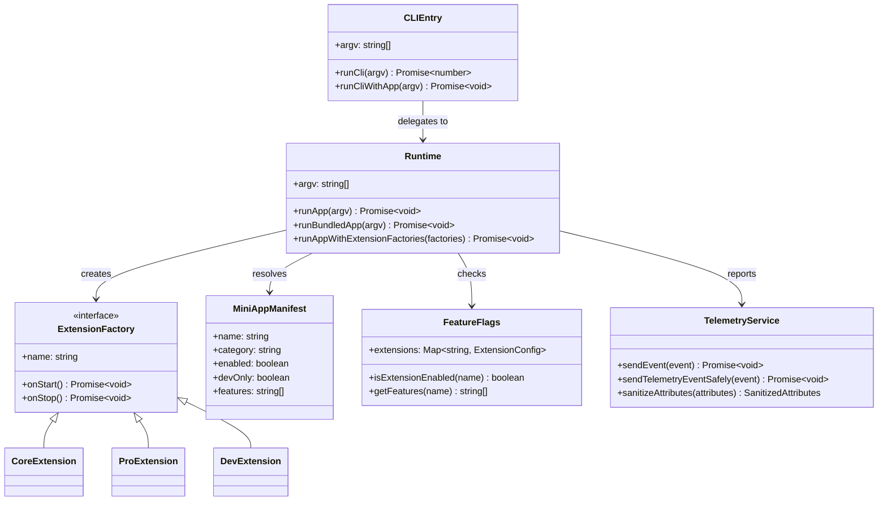

# Class Diagram

## Core Types

## Notes

- ExtensionFactory is the core abstraction; all extensions implement this interface
- Three extension tiers: Core, Pro, Dev — selected at compile time
- MiniAppManifest is read from JSON and used for CLI routing
- FeatureFlags provides runtime evaluation of enabled/disabled state
- TelemetryService is the single telemetry entry point with safe/error handling
