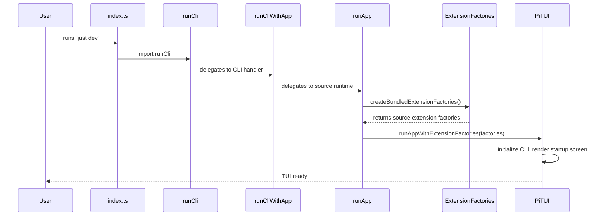
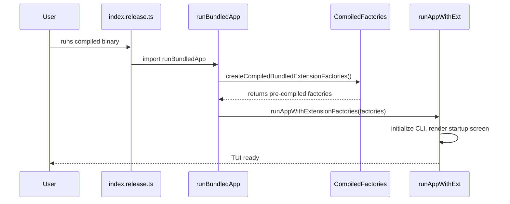
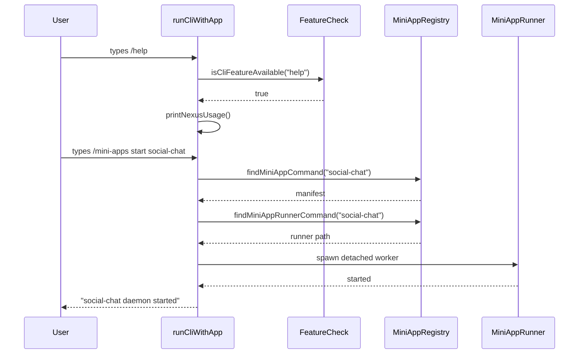
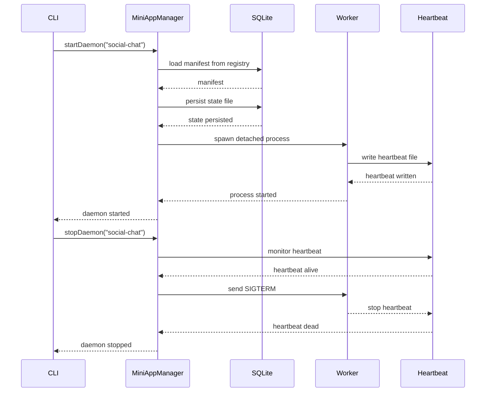

# Sequence Diagrams

## Workflow: Source Mode Startup

When running `just dev`, the source entry point boots the CLI and runtime with source-mode extensions.

### Walkthrough

1. **User input** — [`apps/tui/src/index.ts`](../../../apps/tui/src/index.ts)
2. **CLI delegation** — [`runCli.ts`](../../../apps/tui/src/cli/runCli.ts)
3. **Runtime boot** — [`runApp.ts`](../../../apps/tui/src/runtime/runApp.ts) loads source extensions

## Workflow: Release Binary Startup

When running the compiled binary, pre-compiled extension factories are used for optimized startup.

### Walkthrough

1. **User input** — [`apps/tui/src/index.release.ts`](../../../apps/tui/src/index.release.ts)
2. **Compiled factories** — [`runBundledApp.ts`](../../../apps/tui/src/runtime/runBundledApp.ts)
3. **Shared runtime** — [`runAppWithExtensionFactories.ts`](../../../apps/tui/src/runtime/runAppWithExtensionFactories.ts)

## Workflow: CLI Command Routing

When a user types a CLI command (e.g., `/help`, `/sessions`, `/install`), it's routed through the CLI router.

### Walkthrough

1. **CLI routing** — [`runCliWithApp.ts`](../../../apps/tui/src/cli/runCliWithApp.ts)
2. **Feature gating** — `src/cli/features/isCliFeatureAvailable.ts`
3. **Mini-app resolution** — `findMiniAppCommand` / `findMiniAppRunnerCommand` from `@nexus/mini-apps`

## Workflow: Mini-App Daemon Lifecycle

When a mini-app daemon is started, it spawns a detached worker, persists state, and monitors heartbeats.

### Walkthrough

1. **Daemon start** — [`findMiniAppRunnerCommand`](../../../packages/mini-apps/src/registry/findMiniAppRunnerCommand.ts)
2. **SQLite persistence** — State files persisted to `~/.local/share/nexus/`
3. **Heartbeat monitoring** — Crash detection via heartbeat file checks
